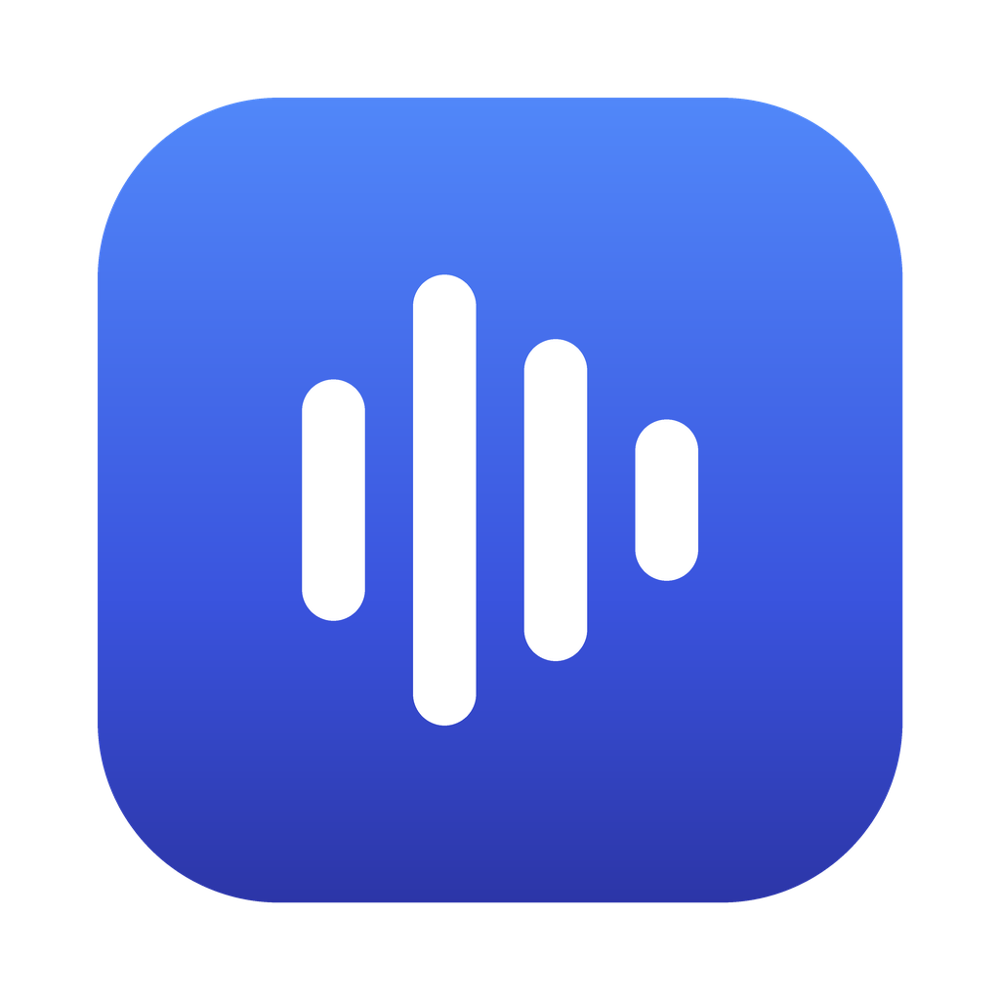
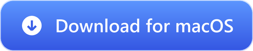
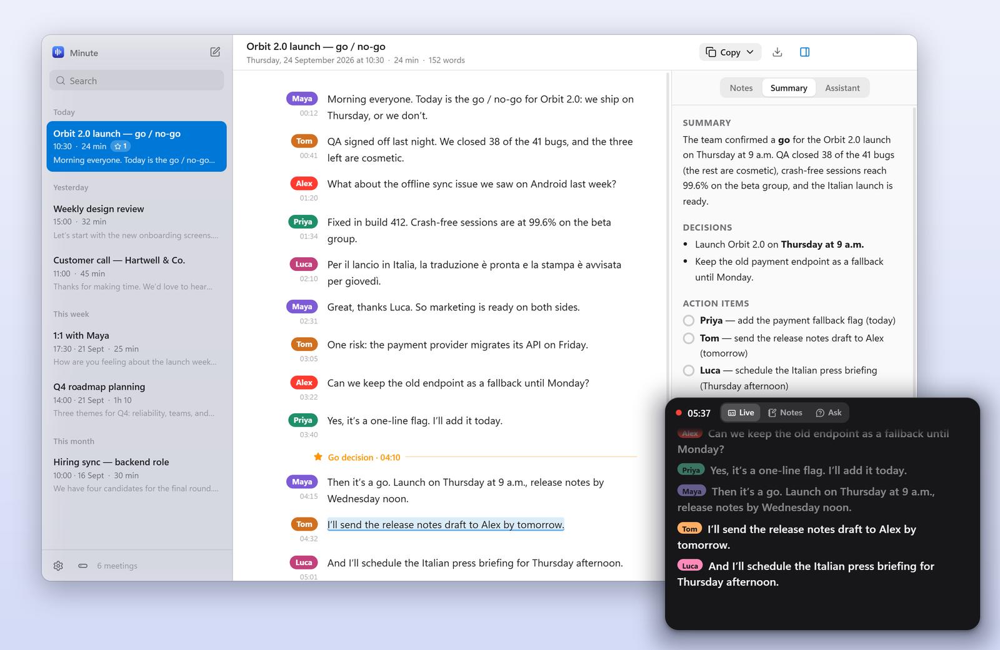
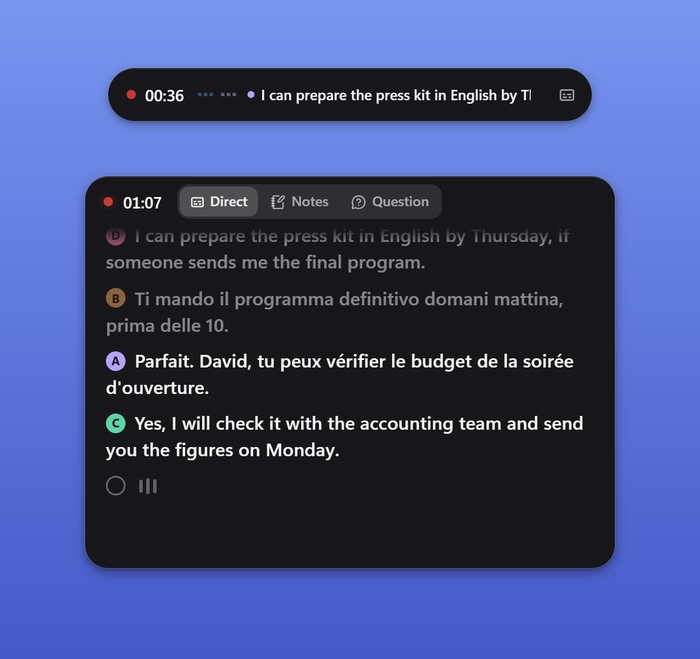
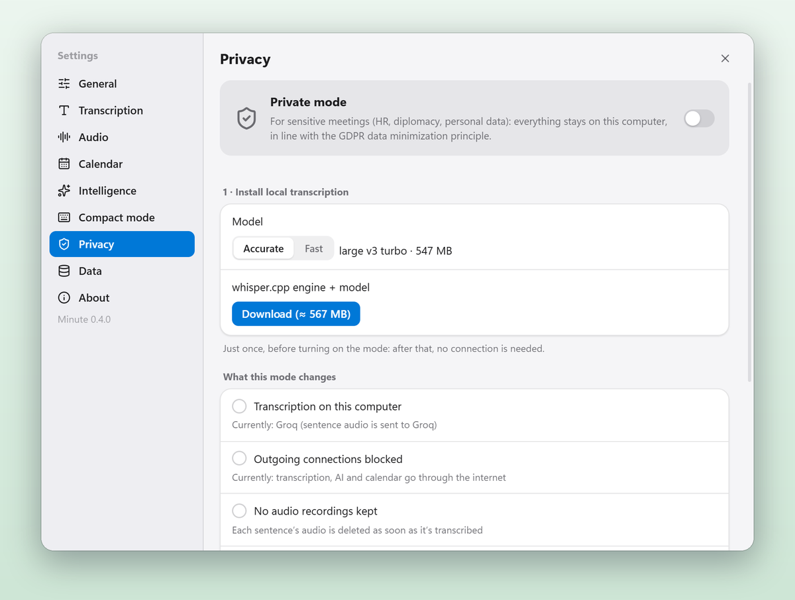

<div align="center">



# Minute

### Your meetings, transcribed live.

Minute writes down every word while people are still talking — and knows who said what.<br/>
Copy any part, catch up on what you missed, ask the meeting a question, get the summary. Without leaving your call.

<br/>

<a href="https://github.com/adrbn/minute/releases/latest/download/Minute-Setup-Windows.exe"></a>
&nbsp;
<a href="https://github.com/adrbn/minute/releases/latest/download/Minute-macOS-arm64.dmg"></a>

<sub>Windows 10 and 11 · macOS 14.2 or later (<a href="https://github.com/adrbn/minute/releases/latest/download/Minute-macOS-x64.dmg">Intel Mac</a>) · Free and open source · <a href="README.fr.md">Lire en français</a></sub>

[](https://github.com/adrbn/minute/releases/latest)
[](#install)
[](LICENSE)

<br/>

<picture>
  <source media="(prefers-color-scheme: dark)" srcset="docs/images/hero-dark.png">
  
</picture>

</div>

## The problem

Most note-takers make you wait until the meeting is over to see a single line. Until then you can't copy
what was just decided, you can't check a figure, and if your mind wandered for two minutes, it's gone.

Minute writes the transcript **during** the meeting, about a second after each sentence. It captures your
microphone and the system audio as two separate sources, so it works with Teams, Zoom, Meet or any other app,
without adding a bot to the call.

## What it does

**Live transcript, with who's speaking.** Every voice is recognised by its timbre, on your computer, and gets
its own colour. Click a voice to name it — or let **Guess who's speaking** work it out from the conversation
("Priya, can you…" → it's Priya who answers).

**Several languages in one meeting.** French, English, Italian… each sentence stays in the language it was spoken in.

**The Dynamic Island.** During a meeting the window steps aside: a floating pill shows the last sentence. Open it for
live captions, quick notes and questions — without bringing Minute back.

<div align="center">

</div>

**Catch up, ask, summarise.** "What did I miss?" gives you the last 2, 5 or 10 minutes in a few bullets, starting with
anything that needs you. "What did we decide about the budget?" answers with links to the exact moments — even in a
two-hour meeting. At the end: summary, decisions, action items, key points, open questions, and the follow-up email.

**Copy anything, any time.** The whole meeting, the last 5 or 10 minutes, or since a marked moment — as plain text
or formatted for Outlook, Word or Teams.

**Your calendar.** Google Calendar or any iCal link: the next meeting is ready to record, with its title and attendees.
Minute can remind you 10 and 5 minutes before.

**Private mode.** For sensitive meetings (Windows): transcription runs 100 % on your computer, every outside
connection is blocked, no audio is kept, and meetings are deleted after the retention period you choose.

<div align="center">

</div>

**And the details.** Search across all your meetings · archive and a 30-day trash · merge or split meetings ·
9 colour themes, light and dark · automatic updates (never during a meeting) · report a problem in one click ·
English, French and Italian interface.

## Install

**Windows 10 or 11** — download [`Minute-Setup-Windows.exe`](https://github.com/adrbn/minute/releases/latest/download/Minute-Setup-Windows.exe)
and run it. It installs for your account, no admin rights needed.

> Windows may say "Windows protected your PC" (the app isn't signed with a paid certificate yet):
> click **More info**, then **Run anyway**.

**macOS 14.2 or later** — download the `.dmg` for your Mac
([Apple Silicon](https://github.com/adrbn/minute/releases/latest/download/Minute-macOS-arm64.dmg) or
[Intel](https://github.com/adrbn/minute/releases/latest/download/Minute-macOS-x64.dmg)) and drag Minute to **Applications**.

> The first time, right-click Minute › **Open**. If macOS says the app is damaged, run
> `xattr -cr /Applications/Minute.app` in Terminal. On your first recording, allow **Microphone** and
> **System Audio Recording**.

## Get started

1. **Get a free Groq key** — one minute, see below — and paste it when Minute asks.
2. Check that your microphone's level bar moves.
3. Click the red button, or use the global shortcut <kbd>Ctrl</kbd><kbd>Alt</kbd><kbd>R</kbd>.

During a meeting, **Minimize** turns the window into the Dynamic Island.

## Keys and connections

Minute has no server and no account: it uses **your** keys, kept encrypted by your system (DPAPI on Windows,
Keychain on macOS). Only one is required.

### Groq — transcription (free)

1. Go to **[console.groq.com](https://console.groq.com)** and sign in.
2. Open **API Keys › Create API Key**, name it "Minute", confirm.
3. Copy the key (it starts with `gsk_`) — it won't be shown again.
4. In Minute: **Settings › Transcription › Groq key**, paste, **Save**. A ✓ confirms it works.

The free tier allows 20 requests per minute and about two hours of audio per hour; Minute manages that budget for
you. At worst, sentences arrive a few seconds late — nothing is ever lost. The same key also writes the summaries.

### Summaries with another AI (optional)

Choose the provider in **Settings › Intelligence** and paste its key:

| Provider | Where to get a key | Good to know |
|---|---|---|
| **Groq** | already done | Free and fast. The default. |
| **Claude** (Anthropic) | [console.anthropic.com › API Keys](https://console.anthropic.com/settings/keys) | The best writing quality. Pay as you go (a few cents per summary). |
| **Gemini** (Google) | [aistudio.google.com › Get API key](https://aistudio.google.com/apikey) | Generous free tier, very long context. |
| **OpenAI** | [platform.openai.com › API keys](https://platform.openai.com/api-keys) | GPT models. Pay as you go. |

### Google Calendar

**The simplest way: an iCal link** (read-only, nothing to set up at Google). In Google Calendar:
**Settings › [your calendar] › Integrate calendar › Secret address in iCal format**. Copy it, then in Minute:
**Settings › Calendar › iCal link**. For Outlook: **Settings › Calendar › Shared calendars › Publish a calendar**,
and copy the **ICS** link.

**With "Sign in with Google"** (organisations where secret links are disabled): an administrator creates an
OAuth client once for everyone.

1. [console.cloud.google.com](https://console.cloud.google.com) › **New project** ("Minute").
2. **APIs & Services › Library** › *Google Calendar API* › **Enable**.
3. **APIs & Services › OAuth consent screen**: **Internal** (Google Workspace), or **External** with your addresses
   as test users for a Gmail account. Add the scope `…/auth/calendar.events.readonly`.
4. **Credentials › Create credentials › OAuth client ID** › **Desktop app** › **Create**.
5. Copy the **client ID** and **client secret**; in Minute: **Settings › Calendar › Advanced**, paste, **Save**,
   then **Sign in with Google**.

Minute only reads your events (title, times, attendees, call link) — nothing else in your account.

### Private mode (no key)

**Settings › Privacy.** Minute downloads the open-source [whisper.cpp](https://github.com/ggml-org/whisper.cpp)
engine once (about 570 MB, or 200 MB for the fast model), then blocks every outside connection. For summaries,
install [LM Studio](https://lmstudio.ai) or [Ollama](https://ollama.com): Minute finds them on its own.

> Local transcription needs a recent computer. On a desktop processor without a dedicated graphics card,
> pick the **Fast** model to keep up with speech.

## Keyboard shortcuts

| | Windows | macOS |
|---|---|---|
| Start / end a meeting (press twice to end) | <kbd>Ctrl</kbd><kbd>Alt</kbd><kbd>R</kbd> | <kbd>⌃</kbd><kbd>⌥</kbd><kbd>R</kbd> |
| Mark a moment | <kbd>Ctrl</kbd><kbd>Alt</kbd><kbd>M</kbd> | <kbd>⌃</kbd><kbd>⌥</kbd><kbd>M</kbd> |
| Copy the transcript | <kbd>Ctrl</kbd><kbd>Alt</kbd><kbd>C</kbd> | <kbd>⌃</kbd><kbd>⌥</kbd><kbd>C</kbd> |
| Dynamic Island | <kbd>Ctrl</kbd><kbd>Alt</kbd><kbd>T</kbd> | <kbd>⌃</kbd><kbd>⌥</kbd><kbd>T</kbd> |

## Your data

- Meetings live **on your computer**, in `Documents/Minute`: one readable folder per meeting.
- In standard mode, only the **audio of each sentence** goes to Groq to be transcribed, and only the **text** goes to
  the AI you picked for summaries. Voice recognition runs on your computer.
- No telemetry, no account, no Minute server.
- For organisations: a [GDPR note for your data protection officer](docs/RGPD.md) (in French).

## FAQ

<details>
<summary><b>English is translated into French in my transcript</b></summary>

Set **Settings › Transcription › Meeting language** to **Multiple languages (auto-detect)**, the default: each sentence stays in its
own language.
</details>

<details>
<summary><b>Nothing shows up for the other participants</b></summary>

Make sure **System audio** is on, on the home screen. On macOS, allow **System Audio Recording** in
*System Settings › Privacy & Security*.
</details>

<details>
<summary><b>Does the Dynamic Island show up when I share my screen?</b></summary>

Not by default: it's hidden from screen sharing and screenshots. To show it, turn off
**Settings › Compact mode › Hide from screen sharing and screenshots**.
</details>

<details>
<summary><b>I deleted a meeting by mistake</b></summary>

It's in the **Trash** (bottom of the sidebar) for 30 days: right-click › **Restore**.
</details>

## Support and feedback

Minute is free, open source and built in my spare time. If it saves you time,
[**buy me a coffee on Ko-fi**](https://ko-fi.com/adrbn) ☕

- **Found a problem?** In Minute: **Settings › About › Report a problem** fills in a GitHub issue for you, with a
  technical log (never any meeting content). Or [open an issue](https://github.com/adrbn/minute/issues/new/choose).
- **An idea?** [Suggest it](https://github.com/adrbn/minute/issues/new?template=feature_request.yml).

## Build from source

```bash
npm install
npm start          # build and run
npm test           # unit tests
npm run dist:win   # Windows installer → release/
```

Pushing a `v*` tag builds Windows and macOS on GitHub Actions and publishes the release, including the files the
auto-updater reads. Electron · React · TypeScript · Silero VAD and CAM++ (ONNX, WebAssembly) · whisper.cpp.
Third-party components: [THIRD_PARTY_NOTICES.md](THIRD_PARTY_NOTICES.md).

## License

[MIT](LICENSE) © 2026 Adrien Robino
