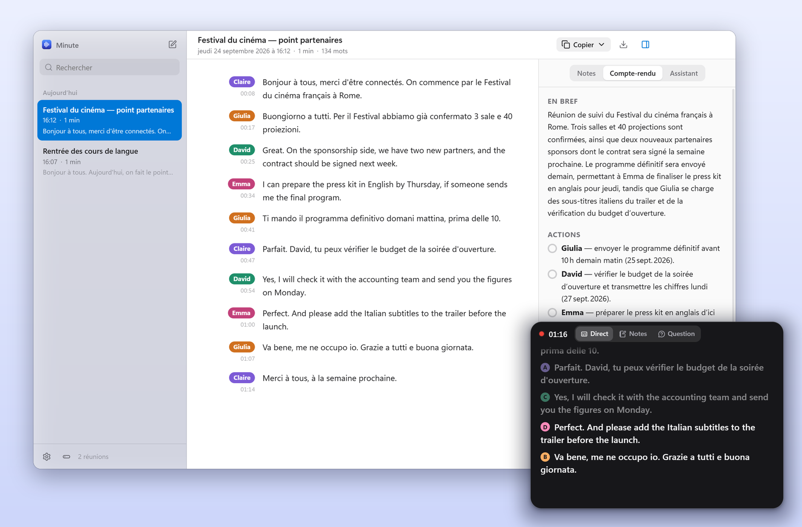
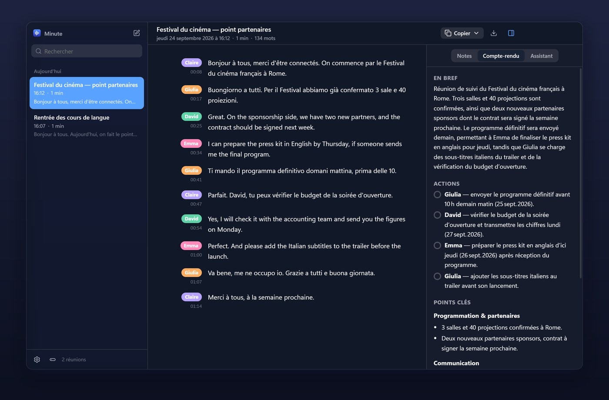
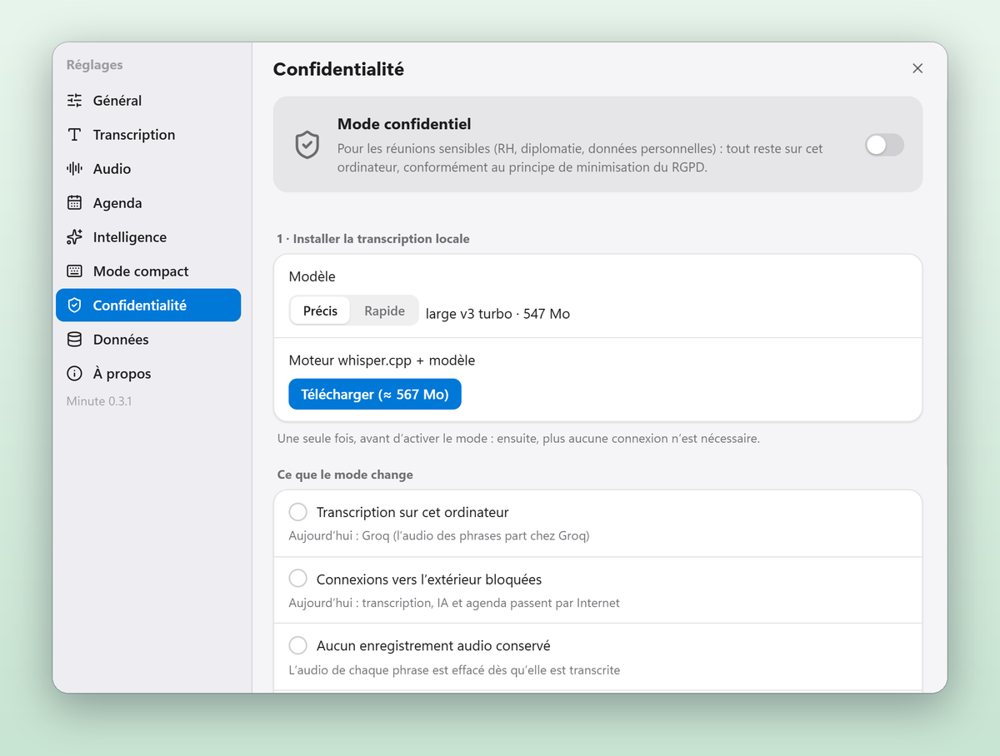
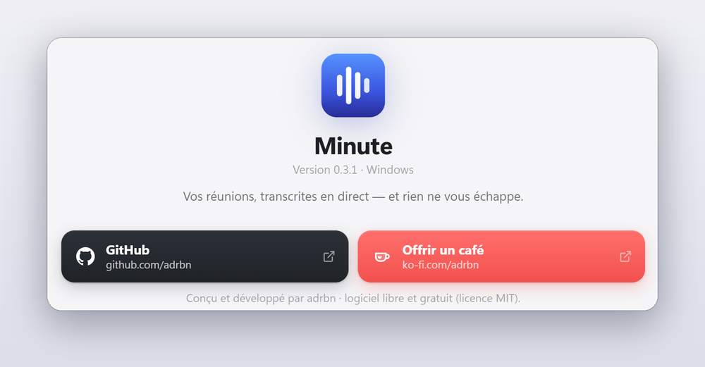

<div align="center">


# Minute

**Vos réunions, transcrites en direct — et rien ne vous échappe.**

Transcription en direct, reconnaissance de qui parle, compte-rendu en un clic,<br>
une Dynamic Island qui vous suit dans Teams, Zoom ou Meet. Pour Windows et macOS.

[](https://github.com/adrbn/minute/releases/latest)
[](https://github.com/adrbn/minute/releases)
[](#installer)
[](#installer)
[](LICENSE)
[](#pourquoi-minute)
[](https://ko-fi.com/adrbn)

<br>

[](https://github.com/adrbn/minute/releases/latest/download/Minute-Setup-Windows.exe)
&nbsp;
[](https://github.com/adrbn/minute/releases/latest/download/Minute-macOS-arm64.dmg)
&nbsp;
[](https://github.com/adrbn/minute/releases/latest/download/Minute-macOS-x64.dmg)

<br><br>



</div>

---

## Pourquoi Minute

Les outils de prise de notes vous font attendre la fin de la réunion pour voir le texte. Minute l'écrit **pendant**
que l'on parle : vous copiez une phrase, vous rattrapez ce que vous avez manqué, vous posez une question à la
réunion — sans jamais quitter votre visio.

- **Libre et gratuit.** Pas de compte, pas d'abonnement. La transcription passe par Groq, dont l'offre
  gratuite suffit pour des heures de réunion par jour.
- **Vos réunions restent chez vous.** Tout est rangé sur votre ordinateur, dans des dossiers lisibles.
- **Pensé comme une app Apple.** Discret, rapide, soigné jusqu'aux animations.

## Ce que Minute fait pour vous

| | |
|---|---|
| **Transcription en direct** | Votre micro et le son de l'ordinateur (Teams, Zoom, Meet…) captés séparément. Le texte arrive environ une seconde après chaque phrase. |
| **Qui parle** | Chaque voix est reconnue à son timbre, sur votre ordinateur : pastilles de couleur Ⓐ Ⓑ Ⓒ. Un clic pour la nommer ; **Deviner qui parle** propose les prénoms d'après la conversation. |
| **Plusieurs langues** | Français, anglais, italien… dans la même réunion : chaque phrase reste dans sa langue. |
| **Copier à tout moment** | Tout, les 5 ou 10 dernières minutes, depuis un moment marqué — en texte et mis en forme pour Outlook, Word ou Teams. |
| **Rattrapage** | « Vous avez décroché ? » : les 2, 5 ou 10 dernières minutes en quelques puces, en commençant par ce qu'on attend de vous. |
| **Demander à la réunion** | « Qu'a-t-on décidé pour le budget ? » — la réponse renvoie aux moments précis, même sur une réunion de deux heures. |
| **Compte-rendu** | En bref, décisions, actions (cases à cocher), points clés, questions ouvertes. Puis l'e-mail de suivi en un clic. |
| **Dynamic Island** | La fenêtre s'efface pendant la réunion : une pastille flottante montre la dernière phrase. Dépliée : sous-titres, notes et questions, sans rouvrir l'app. |
| **Agenda** | Google Agenda ou lien iCal : la prochaine réunion est prête à transcrire, titre et participants compris. |
| **Rangement** | Recherche dans toutes les réunions, archives, corbeille récupérable 30 jours, fusion et séparation de réunions. |
| **Mode confidentiel** | Transcription 100 % locale, aucune connexion vers l'extérieur, pas d'audio conservé, suppression automatique (Windows). |
| **Mises à jour automatiques** | Minute se met à jour tout seul, jamais pendant une réunion. |

<div align="center">
<br>

&nbsp;&nbsp;

<br><sub>La Dynamic Island, en pastille ou en sous-titres · le mode sombre (9 thèmes de couleur)</sub>
</div>

## Installer

**Windows 10 ou 11** — téléchargez [`Minute-Setup-Windows.exe`](https://github.com/adrbn/minute/releases/latest/download/Minute-Setup-Windows.exe)
et lancez-le. L'installation se fait pour votre compte, sans droits administrateur.

> Windows peut afficher « Windows a protégé votre ordinateur » (l'app n'est pas encore signée par un
> certificat payant) : cliquez **Informations complémentaires**, puis **Exécuter quand même**.

**macOS 14.2 ou plus récent** — téléchargez le `.dmg` qui correspond à votre Mac
([Apple Silicon](https://github.com/adrbn/minute/releases/latest/download/Minute-macOS-arm64.dmg), puces M1 à M4 ;
[Intel](https://github.com/adrbn/minute/releases/latest/download/Minute-macOS-x64.dmg)), puis glissez Minute dans
**Applications**.

> Au premier lancement, faites un clic droit sur Minute › **Ouvrir**. Si macOS indique que l'app est
> « endommagée », ouvrez le Terminal et tapez : `xattr -cr /Applications/Minute.app`.
> Au premier enregistrement, autorisez le **Micro** et l'**Enregistrement audio du système**.

Toutes les versions : [page des versions](https://github.com/adrbn/minute/releases).

## Démarrer en deux minutes

1. **Créez votre clé Groq** (gratuite, une minute — [guide ci-dessous](#groq--la-transcription-gratuit)) et collez-la
   au premier lancement.
2. Vérifiez que la barre de niveau de votre micro bouge.
3. Cliquez sur le bouton rouge — ou `Ctrl+Alt+R` depuis n'importe quelle application. C'est tout.

Pendant la réunion, cliquez **Réduire** : Minute se range dans sa Dynamic Island et vous laisse votre visio.

## Guides : clés et connexions

Minute n'a pas de serveur : il utilise **vos** clés, gardées chiffrées par votre système (DPAPI sous Windows,
Trousseau sous macOS). Une seule est nécessaire : Groq.

### Groq — la transcription (gratuit)

1. Ouvrez **[console.groq.com](https://console.groq.com)** et connectez-vous (compte Google ou e-mail).
2. Menu **API Keys › Create API Key**, donnez-lui un nom (« Minute »), validez.
3. Copiez la clé (elle commence par `gsk_`) — elle ne sera plus affichée.
4. Dans Minute : **Réglages › Transcription › Clé Groq**, collez, **Enregistrer**. Un ✓ confirme qu'elle marche.

L'offre gratuite autorise 20 requêtes par minute et environ deux heures d'audio par heure : Minute gère ce
budget tout seul. Au pire, les phrases arrivent avec quelques secondes de retard, **sans rien perdre**.
La même clé sert aussi aux comptes-rendus.

### Comptes-rendus avec une autre IA (facultatif)

Dans **Réglages › Intelligence**, choisissez le fournisseur et collez sa clé :

| Fournisseur | Où créer la clé | À savoir |
|---|---|---|
| **Groq** | déjà fait | Gratuit, très rapide. Par défaut. |
| **Claude** (Anthropic) | [console.anthropic.com › API Keys](https://console.anthropic.com/settings/keys) | La meilleure qualité rédactionnelle en français. Payant à l'usage (quelques centimes par compte-rendu). |
| **Gemini** (Google) | [aistudio.google.com › Get API key](https://aistudio.google.com/apikey) | Offre gratuite généreuse, très long contexte. |
| **OpenAI** | [platform.openai.com › API keys](https://platform.openai.com/api-keys) | Modèles GPT. Payant à l'usage. |

### Google Agenda

**La façon la plus simple : un lien iCal** (lecture seule, aucun réglage chez Google).
Dans Google Agenda : **Paramètres › [votre agenda] › Intégrer l'agenda › Adresse secrète au format iCal**, copiez,
puis dans Minute : **Réglages › Agenda › Lien iCal**. Pour Outlook : **Paramètres › Calendrier › Calendriers
partagés › Publier un calendrier**, et copiez le lien **ICS**.

**Avec « Se connecter avec Google »** (comptes d'organisation où le lien secret est désactivé) : l'administrateur
crée une fois un identifiant OAuth pour toute l'organisation.

1. [console.cloud.google.com](https://console.cloud.google.com) › **Nouveau projet** (« Minute »).
2. **API et services › Bibliothèque** › *Google Calendar API* › **Activer**.
3. **API et services › Écran de consentement OAuth** : type **Interne** (Google Workspace) — ou **Externe** avec
   vos adresses en *utilisateurs de test* pour un compte Gmail. Nom de l'app : Minute.
   Ajoutez le champ d'application `…/auth/calendar.events.readonly`.
4. **Identifiants › Créer des identifiants › ID client OAuth** › type **Application de bureau** › **Créer**.
5. Copiez l'**ID client** et le **code secret**, puis dans Minute : **Réglages › Agenda › Avancé**, collez,
   **Enregistrer**, et **Se connecter avec Google**.

Minute ne lit que vos événements (titre, horaires, participants, lien de visio), jamais le reste de votre compte.

### Mode confidentiel (sans clé)

Pour les réunions sensibles : **Réglages › Confidentialité**. Minute télécharge une fois le moteur de
transcription open source [whisper.cpp](https://github.com/ggml-org/whisper.cpp) (≈ 570 Mo, ou 200 Mo pour le modèle
rapide) puis coupe toute connexion vers l'extérieur. Pour les comptes-rendus, installez
[LM Studio](https://lmstudio.ai) ou [Ollama](https://ollama.com) : Minute les trouve tout seul.

> La transcription locale demande un ordinateur récent : sur un processeur de bureau sans carte graphique
> dédiée, choisissez le modèle **Rapide** pour suivre la parole en direct.

<div align="center">

</div>

## Raccourcis

| Action | Windows | macOS |
|---|---|---|
| Démarrer / terminer une réunion (deux appuis pour terminer) | `Ctrl+Alt+R` | `⌃⌥⌘R` |
| Marquer un moment important | `Ctrl+Alt+M` | `⌃⌥⌘M` |
| Copier la transcription | `Ctrl+Alt+C` | `⌃⌥⌘C` |
| Dynamic Island | `Ctrl+Alt+T` | `⌃⌥⌘T` |

Tous modifiables dans **Réglages › Mode compact**.

## Vos données

- Les réunions sont rangées **sur votre ordinateur**, dans `Documents/Minute` : un dossier par réunion, lisible
  sans Minute.
- En mode standard, seul l'**audio des phrases** part chez Groq pour être transcrit, et seul le **texte** part chez
  l'IA choisie pour les comptes-rendus. La reconnaissance des voix est calculée sur l'ordinateur.
- Aucune télémétrie, aucun compte, aucun serveur Minute.
- Pour les organisations : [note RGPD pour le délégué à la protection des données](docs/RGPD.md).

## Questions fréquentes

<details>
<summary><b>L'anglais de mon interlocuteur est traduit en français</b></summary>

Réglez **Réglages › Transcription › Langue des réunions** sur **Plusieurs langues** (le réglage par défaut) : chaque
phrase reste dans sa langue. En « Français uniquement », Whisper écrit tout en français.
</details>

<details>
<summary><b>Je n'entends rien côté « participants »</b></summary>

Vérifiez que **Son de l'ordinateur** est activé sur l'écran d'accueil. Sous macOS, autorisez
**Enregistrement audio du système** dans *Réglages Système › Confidentialité et sécurité*.
</details>

<details>
<summary><b>La Dynamic Island apparaît-elle quand je partage mon écran ?</b></summary>

Non par défaut : elle est invisible dans les partages d'écran et les captures. Pour la montrer (ou la capturer),
décochez **Réglages › Mode compact › Masquer des partages d'écran et captures**.
</details>

<details>
<summary><b>J'ai supprimé une réunion par erreur</b></summary>

Elle est dans la **corbeille** (icône en bas de la barre latérale) pendant 30 jours : clic droit › **Restaurer**.
</details>

<details>
<summary><b>Je viens de Natively</b></summary>

**Réglages › Données › Importer depuis Natively** reprend vos transcriptions et comptes-rendus, sans modifier Natively.
</details>

## Soutenir et contribuer

Minute est libre, gratuit et développé sur mon temps libre. S'il vous fait gagner du temps :

<a href="https://ko-fi.com/adrbn"></a>

- **Un problème ?** Dans Minute : **Réglages › À propos › Signaler un problème** — le ticket GitHub se remplit tout
  seul avec le journal technique (jamais de contenu de réunion). Ou [ouvrez un ticket](https://github.com/adrbn/minute/issues/new/choose).
- **Une idée ?** [Proposez-la](https://github.com/adrbn/minute/issues/new?template=feature_request.yml).
- **Une étoile ⭐** sur GitHub aide d'autres personnes à découvrir Minute.

<div align="center">

</div>

---

## Développement

```bash
npm install
npm start           # compile et lance l'app
npm test            # tests (filtres, voix, recherche, fusion, confidentialité…)
npm run typecheck
npm run dist:win    # installeur Windows → release/
```

Un tag `v*` poussé sur GitHub construit Windows et macOS (GitHub Actions) et publie la version, avec les fichiers
que lit la mise à jour automatique.

<details>
<summary>Architecture</summary>

```
src/
  main/            process principal (Node)
    recorder.ts      file de transcription persistante, budget Groq, écho, reprise après crash
    groq.ts          client Whisper (Groq) · localStt.ts : whisper.cpp local (mode confidentiel)
    voices.ts        regroupement des empreintes de voix (qui parle)
    ai.ts, llm.ts    comptes-rendus, rattrapage, questions (Groq, Claude, Gemini, OpenAI, IA locale)
    retrieval.ts     passages utiles pour répondre sur une longue réunion
    privacy.ts       verrou réseau du mode confidentiel
    updater.ts       mises à jour automatiques · diag.ts : rapport de problème
    store.ts         dossiers de réunion (meeting.json + transcript.jsonl en ajout seul)
    compact.ts       Dynamic Island : fenêtre flottante, lancer façon image dans l'image, morphing
  renderer/
    engine/          fenêtre invisible : capture, Silero VAD, découpage, empreinte de voix (CAM++)
    app/             interface principale (React)
    mini/            Dynamic Island
  shared/            types et mise en forme communs (ce qu'on voit = ce qu'on copie)
```

- **Son de l'ordinateur** : Windows via la boucle système de Chromium ; macOS via
  [AudioTee](https://github.com/makeusabrew/audiotee) (Core Audio Taps), compilé en binaire universel par la CI.
- **Découpage** : Silero VAD v5 (ONNX, WASM) sur des trames de 32 ms, phrases de 3 à 16 s.
- **Qui parle** : fbank Kaldi en TypeScript + CAM++ (3D-Speaker) en WASM, regroupement en ligne puis affinage en fin
  de réunion.
- **Tester sans clé** : `npm run mock:groq`, puis `MINUTE_GROQ_BASE=http://127.0.0.1:8765/openai/v1`.
  `MINUTE_PROFILE_DIR` et `MINUTE_STORAGE` isolent un profil de test.
- **Mac signé et notarisé** : ajoutez les secrets `MAC_CERT_P12_BASE64`, `MAC_CERT_PASSWORD`, `APPLE_ID`,
  `APPLE_APP_SPECIFIC_PASSWORD`, `APPLE_TEAM_ID` (compte Apple Developer requis).
</details>

Composants tiers et leurs licences : [THIRD_PARTY_NOTICES.md](THIRD_PARTY_NOTICES.md).

## Licence

[MIT](LICENSE) © 2026 Adrien Robino — libre d'utiliser, de modifier et de partager.
